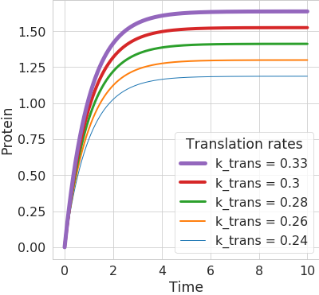
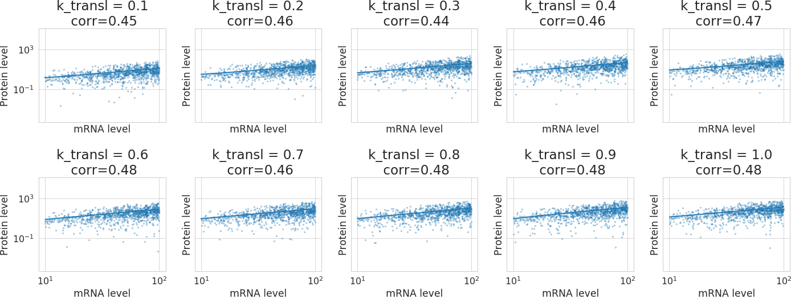
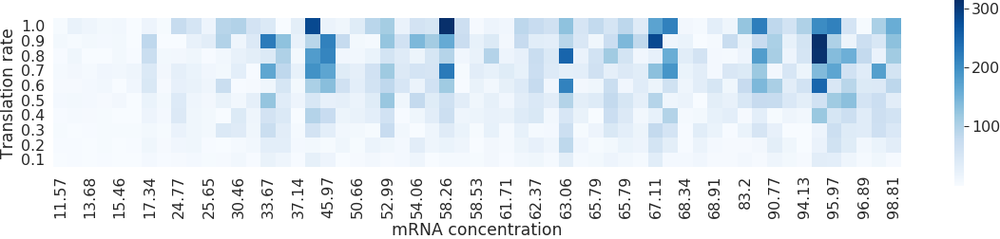

# Protein-Expression-Dynamics
Numerically simulating a protein expression system using first order differential equation from the paper [Global signatures of protein and mRNA expression levels ](https://www.ncbi.nlm.nih.gov/labs/pmc/articles/PMC4089977/). 

The numerical analysis uses [`odeint`](https://docs.scipy.org/doc/scipy/reference/generated/scipy.integrate.odeint.html) from `SciPy`.

An obvious result is the increase of protein levels with the increase of translation rates.

A _not so obvious_ result is that despite the lower translation rates (k_transl), the Spearman's correlation (corr) between mRNA and protein levels will still remain somewhat constant. This simulation uses 1,000 different mRNAs with different concentration and degradation rates.

And the protein at steady state (shown as colour bar below) might be high despite low- _ish_ mRNA levels, if the translation rate is high. Of course, the output maybe limited in real world because of a finite production capacity of cellular systems.

