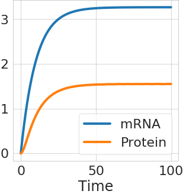

# Protein-Expression-Dynamics
Numerically simulating a protein expression system using first order differential equation from the papers [Global signatures of protein and mRNA expression levels ](https://www.ncbi.nlm.nih.gov/labs/pmc/articles/PMC4089977/) and [The role of mRNA and protein stability in gene expression](https://pubmed.ncbi.nlm.nih.gov/2676679/). 

The numerical analysis uses [`solve_ivp`](https://docs.scipy.org/doc/scipy/reference/generated/scipy.integrate.solve_ivp.html) (this is so much better than `odeint`) from `SciPy`. First, a simple model, which assumes a constant mRNA, is simulated. Then a more complicated model with a system of differential equations for transcription, mRNA decay and protein expression is solved.

#### Assuming a constant mRNA

An obvious result is the increase of protein levels with the increase of translation rates.

A _not so obvious_ result is that despite the lower translation rates (k_transl), the Spearman's correlation (corr) between mRNA and protein levels will still remain somewhat constant. This simulation uses 1,000 different mRNAs with different concentration and degradation rates.

And the protein at steady state (shown as colour bar below) might be high despite low- _ish_ mRNA levels, if the translation rate is high. Of course, the output maybe limited in real world because of a finite production capacity of cellular systems.

#### Including transcription and mRNA decay
This complicates things a bit, because we are now looking at a set of coupled differential equations. First one is the equation for mRNA:

Followed by equations for protein:

where,

These equations are eqn 3 and 1 from the paper [The role of mRNA and protein stability in gene expression](https://pubmed.ncbi.nlm.nih.gov/2676679/).

Both mRNA and protein reach a steady state. 

At steady state, the proportionality factor changes for different translation rates, but the Spearman's correlation still is somewhat constant.

